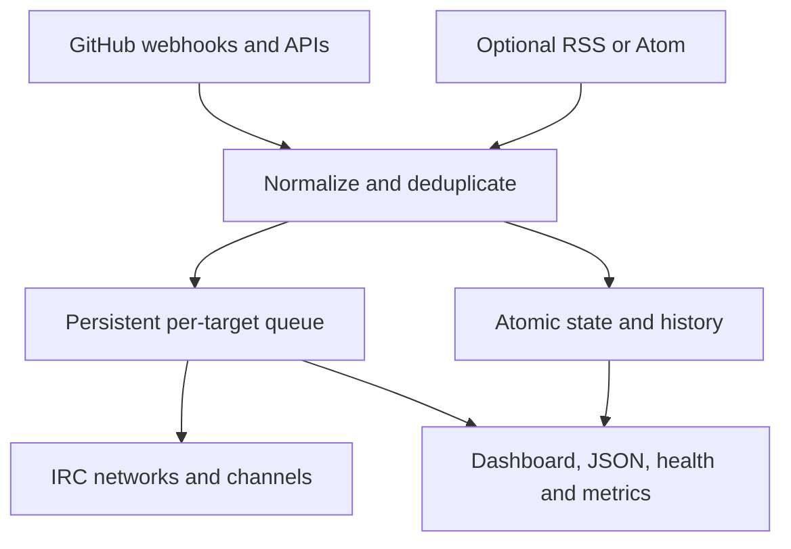

# Architecture and guarantees

IRC GitWatch is deliberately one event loop and one persistent state document. This keeps event ordering explicit and makes recovery inspectable.

## Event acquisition

Signed webhooks provide low latency. Repository event polling provides reconciliation when delivery is delayed or missing. Both paths normalize into the same event model and fingerprint space.

GitHub Actions, repository traffic, public account inventory and RSS each have independent adaptive schedules. Exactly one maintenance family advances per event-loop turn so an optional slow source does not monopolize local HTTP or IRC work.

Completed Actions runs are normalized into a separate bounded history (30 days, at most 500 runs) during the existing Actions scan. Reliability and incident summaries are computed from that local state, so dashboard, IRC, JSON and Prometheus consumers do not create additional GitHub traffic.

## Delivery invariant

One normalized announcement becomes one queue record with an explicit target set. Every network/channel acknowledges delivery independently. A record leaves the queue only after every target has succeeded; partial progress survives state saves and restarts.

The queue is bounded. When space is exhausted, eviction and partial-delivery loss are separately counted and surfaced rather than hidden.

## State invariant

- JSON state schema version 11.
- Atomic temporary-file write and rename.
- Mode `0600`.
- Optional validated `.bak` recovery copy.
- Bounded histories, IDs, fingerprints, delivery audits, CI runs and account changes.
- Legacy activity text is repaired at display/serialization boundaries without rewriting unrelated strings.

## Scope and privacy invariant

- Webhook repository must equal `GITHUB_REPO`.
- GitHub REST URLs are constructed and checked against the configured repository/account scope.
- Portfolio inventory accepts only non-private owner repositories for `GITHUB_ACCOUNT`.
- Security-alert event classes are deliberately not announced.
- Configured credentials and private channel keys are excluded from every read-only surface.
- GitHub unique-cloner/visitor aggregates are never presented as raw IP data.

## Failure behavior

Network reconnects use bounded backoff. GitHub primary and secondary limits pause REST maintenance without blocking signed webhooks, dashboard requests or already-queued IRC delivery. Each optional subsystem reports `off`, `waiting`, `limited`, `online` or `error` as appropriate.

SIGTERM/SIGINT request a graceful state save and IRC quit. systemd restarts only on failure.

## Compatibility surfaces

Treat these as public interfaces:

- environment variable names and defaults;
- state schema and migration behavior;
- IRC command vocabulary;
- JSON response fields and route paths;
- Prometheus metric names and labels;
- webhook verification and deduplication behavior.

Every change to one of these surfaces needs a deterministic regression check and a changelog note.

## Validation invariant

Validation is layered so development feedback stays quick without weakening the release gate:

- `targeted` checks TLS availability, Perl syntax, the named built-in registry and both retained state contracts;
- `fast` adds unrelated-account configurations, the public CI contract and dashboard JavaScript syntax;
- `full` adds credential discovery, the exact public-tree contract and Git repository hygiene.

The v0.29 and v0.30 fixtures are intentionally small synthetic documents. They exercise scalar and structured pending delivery, retained CI history, unknown additive fields and normalization bounds without containing a production token, channel or state dump.

Public CI executes the full profile on Ubuntu 24.04 and in Debian 12/13 job containers. Every reusable GitHub Action is referenced by a full commit SHA, and checkout credentials are removed before the test steps run.
